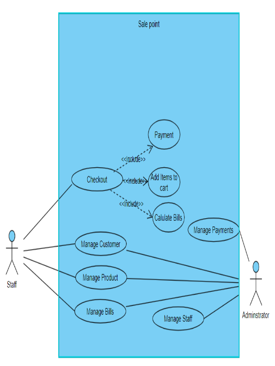
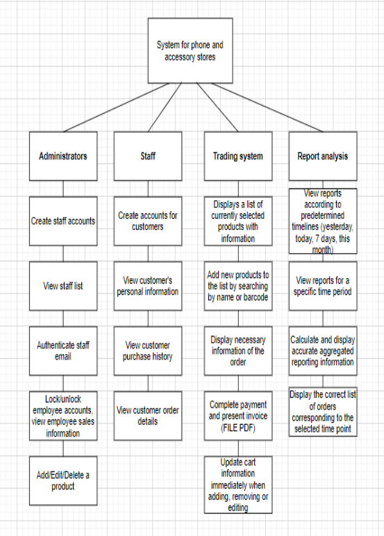
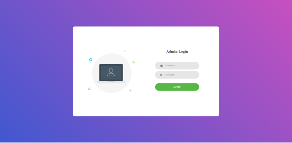
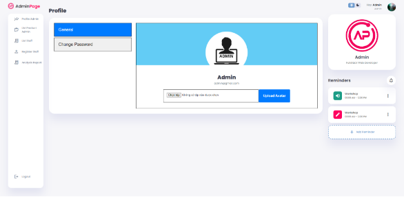
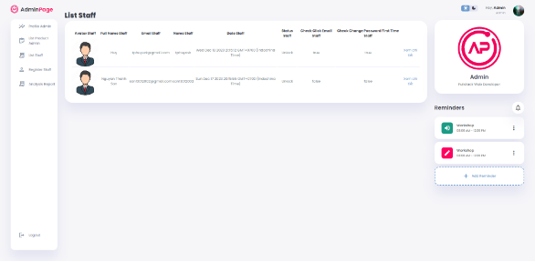
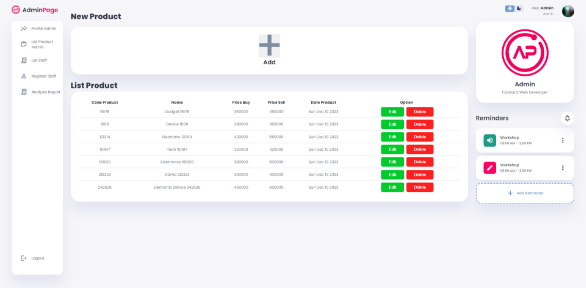
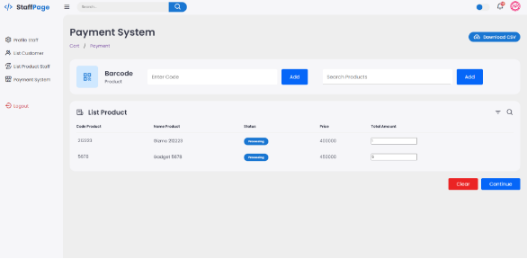
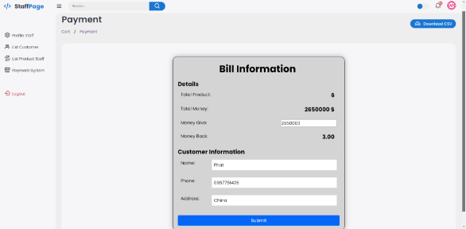

# Mobile Retail Store Application

## Introduction

In today's digital era, technology plays a crucial role in improving shopping experiences. Consumers increasingly prefer convenient online platforms when purchasing technology products, especially mobile phones.

This application was developed using Node.js to provide an efficient and user-friendly system for managing and purchasing mobile devices. The platform allows users to easily search, explore, and select phones based on their individual needs. It supports a wide range of products, including the latest models and exclusive devices available through the store.

The system aims to provide a convenient and modern retail experience while improving product management and customer interaction.

---

## Technologies Used

### Backend
- Node.js

### Frontend
- EJS Template Engine
- HTML
- CSS
- JavaScript

### Database
- MongoDB  

---

## Features

### Use Case Diagram

### Functional Decomposition Diagram

---

## Screenshots

### Admin Login

### Admin Profile

### Staff Management

### Product Management

### Cart

### Payment

---

## Setup

### Step 1: Create GitHub Repository

Create a repository and push the source code to GitHub.

Repository link:  
https://github.com/xianfuhui/paymentshop-app

---

### Step 2: Configure MongoDB Atlas

Create a MongoDB Atlas cluster and update the connection string inside the `.env` file.

Example:

MONGO_URI=your_mongodb_connection_string

---

### Step 3: Deploy using Render

1. Go to https://render.com/
2. Select **Deploy a Web Service**
3. Connect the GitHub repository
4. Configure the deployment settings

Example configuration:

- Name: paymentshop-app  
- Region: Oregon (US West)  
- Branch: main  
- Runtime: Node  
- Build Command: yarn  
- Start Command: npm start  

---

### Step 4: Access the Application

After deployment, access the system via:

https://paymentshop-app.onrender.com/

---

## Author

Name: Tien Phu Huy  
Email: tphuyvvk@gmail.com  
GitHub: https://github.com/xianfuhui
